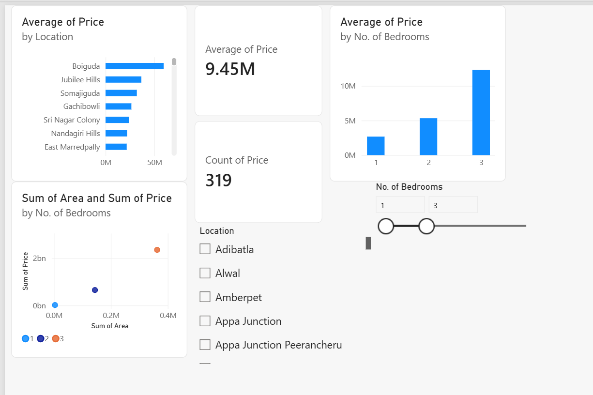
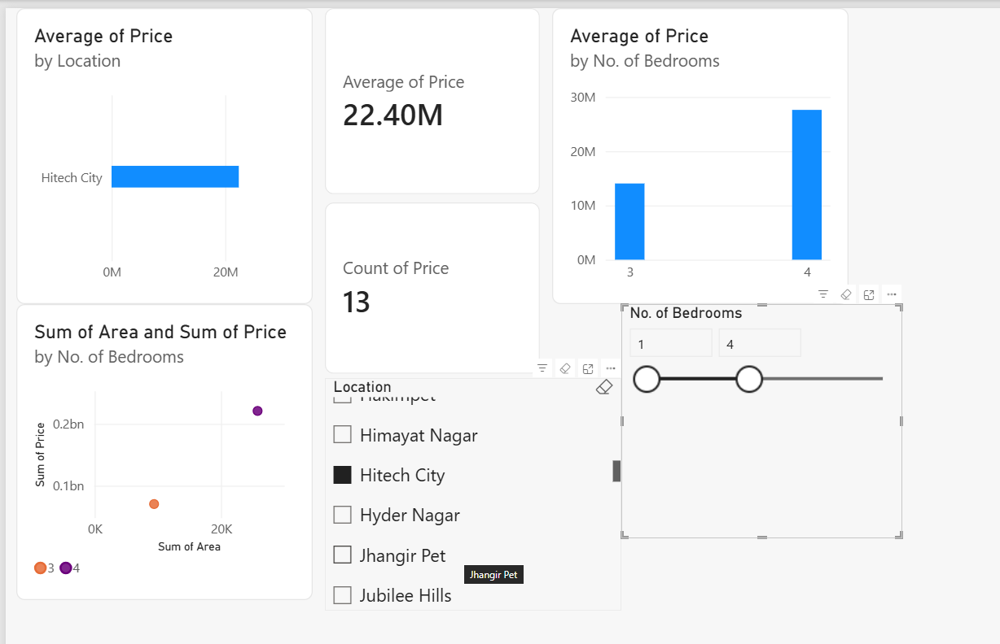

# 🏠 Hyderabad Real Estate Dashboard

An interactive Power BI dashboard analyzing residential property prices across Hyderabad localities.

## 📌 Data Source
Dataset: "Housing Prices in Metropolitan Areas of India" (Kaggle) — Hyderabad.csv, containing Price, Area, Location, No. of Bedrooms, and amenity flags for property listings.

## ⚙️ Approach
- Cleaned data in Power Query (type conversion, duplicate removal)
- Created a calculated column: Price_per_Sqft = Price / Area
- Built 4 interactive visuals with cross-filtering slicers

## 🛠️ Tech Stack
Power BI Desktop, Power Query, DAX

## 📊 Dashboard Features
- Bar chart: Average price by locality
- Scatter plot: Area vs Price (colored by bedroom count)
- Column chart: Average price by number of bedrooms
- KPI cards: Average price, total listings
- Slicers: Location, No. of Bedrooms (fully interactive cross-filtering)

## 💡 Key Insights
- Gachibowli shows the highest average property price among analyzed localities
- 3-BHK properties command significantly higher average prices than 2-BHK

## 📷 Screenshots

## 🔗 Author
Huzef Khan — [GitHub](https://github.com/Huzefkhan1) | [LinkedIn](https://linkedin.com/in/huzef-khan)